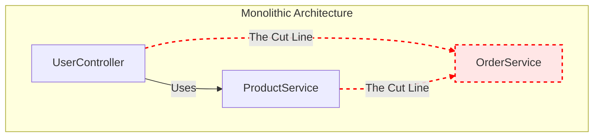

# Session 09: System Architecture and Microservice Migration

## 1. Component Diagram

The following diagram represents our current monolithic architecture. The red dotted arrows indicate **"The Cut Line"**, which marks the boundaries where `OrderService` will be decoupled from the rest of the monolith to become an independent microservice.

## 2. Explanation of "The Cut Line"

**The Cut Line** represents the specific architectural boundary where a monolithic system is logically and physically divided to extract a component into a standalone microservice. 

In this diagram, the cut line surrounds the `OrderService`. It identifies the exact points of coupling (such as direct function invocations, shared memory, or shared database access) that currently exist between `OrderService` and the rest of the monolith (`UserController` and `ProductService`). 

To successfully migrate `OrderService` into its own microservice, these "cut lines" dictate where code refactoring is required. The direct internal dependencies crossing this line must be replaced with inter-service network communication protocols, such as RESTful APIs, gRPC, or asynchronous message queues (e.g., RabbitMQ or Kafka).

## 3. GenAI Prompts Used in This Session

Below are the generative AI prompts utilized during this session to assist with architectural planning:

**Prompt 1: Separation of Concerns**
> *"Act as an expert system architect. Review our current monolithic Node.js/Express application which contains a UserController, ProductService, and OrderService tightly coupled together. How can we apply the 'Separation of Concerns' principle to decouple these modules, isolate their respective business logic, and prepare the overall architecture for future scalability?"*

**Prompt 2: Microservice Dependencies**
> *"Analyze the dependency graph for the OrderService within our current monolith. Identify the potential bottlenecks, shared data models, and direct synchronous function calls between OrderService and the other components (UserController, ProductService). Provide a step-by-step strategy for safely breaking these dependencies so we can cleanly extract OrderService into an independent microservice without disrupting the existing system."*
