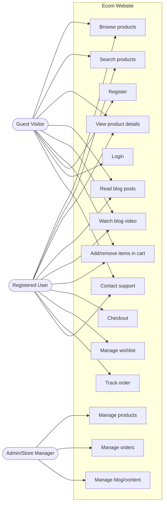

# Ecom Website Use Case Diagram     

This diagram shows the main user interactions for the eCommerce template.

Notes:
- Guests can browse, search, and read content without logging in.
- Checkout and wishlist are typical registered-user actions.
- Admin roles manage products, orders, and site content.
