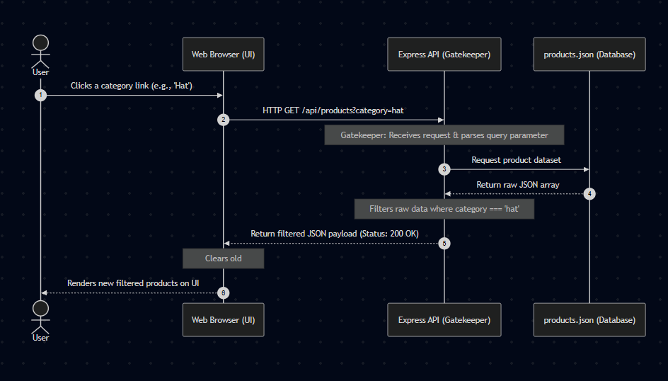

# Weekend Work: Product Filter API Integration

## 1. API Contract Table

This contract defines the communication details between the Frontend application and the Express.js Backend for the product filtering feature.

| Aspect | Details |
| :--- | :--- |
| **Method** | `GET` |
| **Endpoint** | `/api/products?category={name}` |
| **Headers** | `Accept: application/json` |
| **Query Parameter** | `category` (optional) - The name of the category to filter by (e.g., `hat`) |
| **Success Status Code**| `200 OK` |
| **Error Status Code** | `500 Internal Server Error` |
| **Response Body (JSON)**| `{ "success": true, "count": 10, "category": "hat", "data": [ ... ] }` |

## 2. Sequence Diagram

The following sequence diagram illustrates the request cycle and data flow when a user interacts with the category filter on the user interface.

## 3. GenAI Prompts

"Based on the API Contract and Sequence Diagram, please write an Express.js route for a GET request to /api/products.

Requirements:

It must accept a query parameter for 'category' (e.g., ?category=hat).
If the category exists, filter the product data. If not, return all products.
The product data should be read from a local JSON file.
Crucial: Ensure your code has detailed comments explaining how it works and how the query parameter logic is handled.
Please provide the JavaScript code."